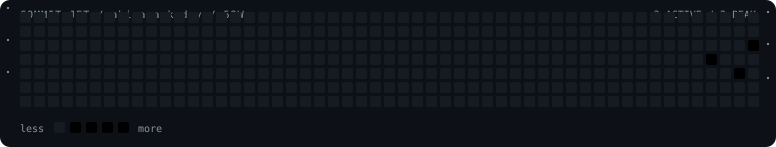

  <a href="https://abinaya-k-dev.github.io">
    <picture>
      <source media="(prefers-color-scheme: dark)" srcset="dark.svg">
      
    </picture>
  </a>

  

  

  
  
  
  
  
  
  
  

---

## About me

A **Mathematics graduate** turned self-taught builder, currently learning **Python, Git, APIs and machine learning** from the ground up — while juggling a few other full-time roles: mother, creator, athlete, cook.

I believe in **learning in public**: shipping small real projects instead of just finishing tutorials.

## What I am building now

| Project | Status | What it does |
|---|---|---|
| Spendmate | In progress | Expense tracker that reads bank SMS + UPI notifications, filters out spam loans and lottery messages, verifies every transaction by its UPI Ref No, and tracks monthly spending automatically |

## What I do

| Role | What it means |
|---|---|
| Developer | Python, Git, APIs, ML - building in public from scratch |
| Mom | Patience, consistency and problem-solving - at home and in code |
| Creator | Content editing, proofreading, video editing with CapCut |
| Athlete | Former intercollegiate basketball player, still training daily |
| Foodie | Cooking keeps everything grounded - a kitchen full of color |

## GitHub stats

  
  

## Portfolio

  

## Contact

- Email: [may15july9@gmail.com](mailto:may15july9@gmail.com)
- Location: Madurai, Tamil Nadu, India

Built from scratch with patience and a lot of chai - 2026
